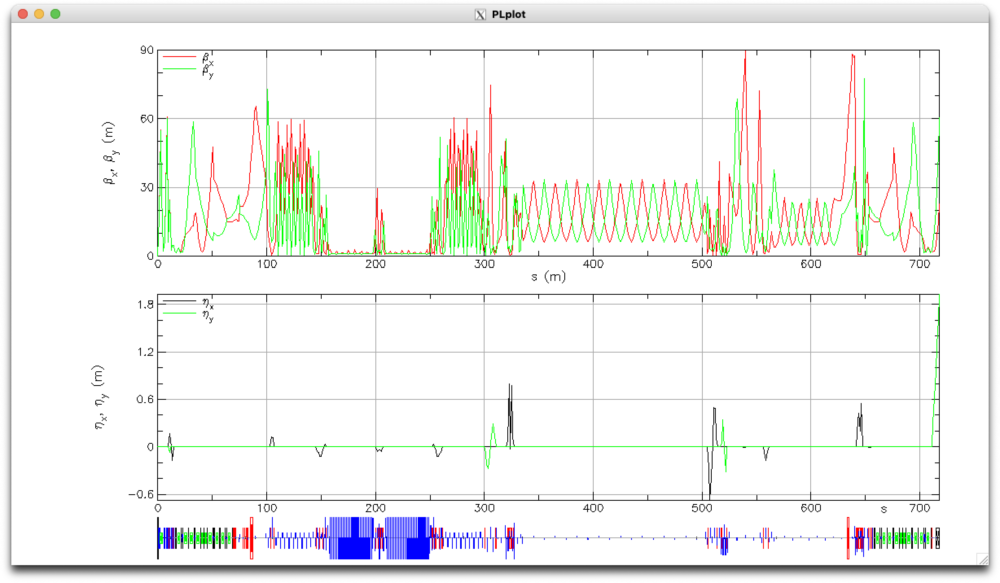
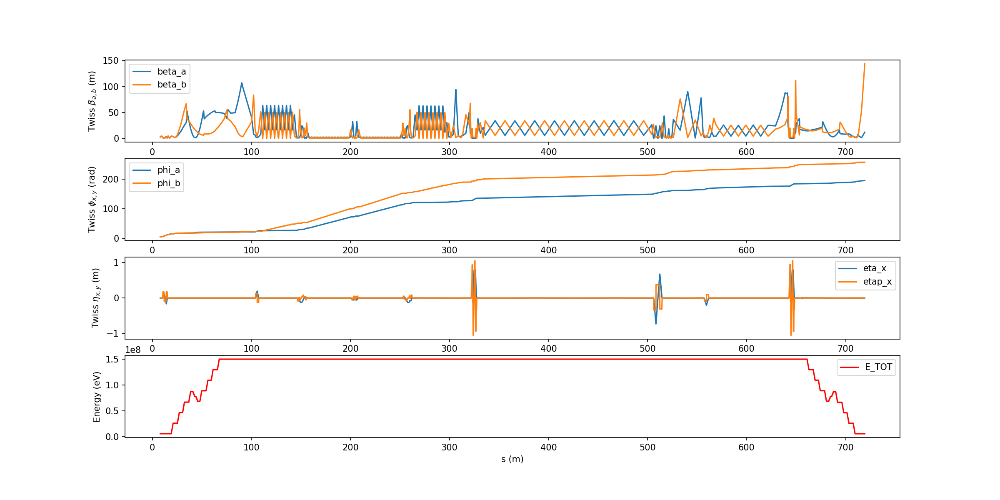
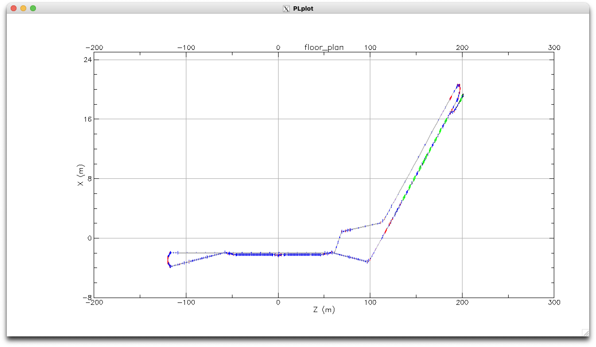

# EIC-Cooler


## Optics

The optics are matched through the center of the cooling section.

View in tao:
```bash
tao -init $EIC_LATTICE/bmad/models/cooler/tao.init
```




## Mode A table
[cooler_modea_20220424_table.csv](data/cooler_modea_20220424_table.csv)



## Layout with IR2

```bash
tao -init $EIC_LATTICE/bmad/models/cooler/tao.init
```

```
place r00 floor4
x-s all -200 200
sc all -5 15
```



[](https://www.classe.cornell.edu/~cem52/cooler/eic_cooler_ir2.html)


Also see the [Interactive Layout](https://www.classe.cornell.edu/~cem52/cooler/eic_cooler_ir2.html)
